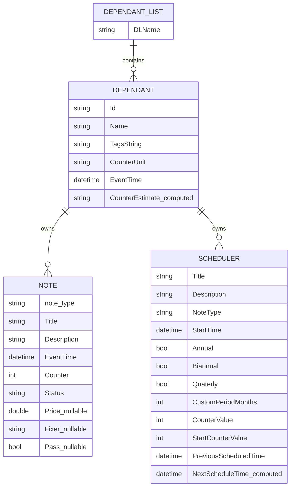

# 1) Domain Overview
- Domainin juurirakenne on `DependantList`, joka kokoaa useita `Dependant`-olioita.
- Jokaisella `Dependant`-oliolla on kaksi paakokoelmaa:
  - `NItems` (notet)
  - `SItems` (schedulerit)
- Note-malli on polymorfinen:
  - `Note` (base)
  - `Service` (extends `Note`)
  - `Inspection` (extends `Service`)
- Schedulerit luovat noteja saantojen perusteella (`GenerateNote`) ja nojaavat riippuvaisen laskennalliseen kayttodataan (`CounterIncreaseInDay`, `HighestCounterNote`).
- Runtime-tilassa notet kerataan myos staattiseen globaaliin listaan `Note.Items`, jota `NotesList` peilaa.
- Data on kaytannossa in-memory singletonin (`DataManager`) takana, alustus testidatalla.

# 2) Entity Field Catalog

## Dependant
| Field | Type | Class | Notes |
|---|---|---|---|
| Id | string | Persisted | Ei pakotettua generointia |
| Name | string | Persisted | Paanimi |
| Tags | string[] | Persisted | Splitattu tag-data |
| TagsString | string | Persisted | Yhdistetty tagiteksti |
| CounterUnit | string | Persisted | Esim. `km`, `h` |
| EventTime | DateTime | Persisted | Viiteaika |
| NItems | List<INote> | Persisted | Note-kokoelma |
| SItems | List<IScheduler> | Persisted | Scheduler-kokoelma |
| NItemsOrderByDescendingByEventTime | List<INote> | Computed | `[JsonIgnore]`, lajiteltu nakyma |
| SItemsOrderByByEventTime | List<IScheduler> | Computed | `[JsonIgnore]`, lajiteltu nakyma |
| CounterEstimate | string | Computed | `[JsonIgnore]`, laskettu teksti |

## DependantList
| Field | Type | Class | Notes |
|---|---|---|---|
| (base list items) | List<IDependant> | Persisted | Varsinainen data |
| DLName | string | Persisted | Nimi |
| Items | List<IDependant> | Computed | Lajiteltu nakyma |

## NotesList
| Field | Type | Class | Notes |
|---|---|---|---|
| (base list items) | List<INote> | Transient | Ei kaytetty paavarastona |
| Items | List<INote> | Computed | Rakennetaan `Note.Items`-staattisesta listasta |

## Note (base)
| Field | Type | Class | Notes |
|---|---|---|---|
| Title | string | Persisted | Otsikko |
| Description | string | Persisted | Kuvaus |
| EventTime | DateTime | Persisted | Paivamaara |
| Counter | int | Persisted | Kayttolaskuri |
| Status | NoteStatus | Persisted | `SCHEDULED` / `UPDATED` |
| Items (static) | List<INote> | Transient | Globaali runtime-koonti |
| ListText | string | Computed | `[JsonIgnore]` |
| ListTextAllNotes | string | Computed | `[JsonIgnore]` |
| Dependant | IDependant | Transient | `[JsonIgnore]`, runtime-viite |

## Service
| Field | Type | Class | Notes |
|---|---|---|---|
| Price | double | Persisted | Hinta |
| Fixer | string | Persisted | Tekija |
| CLASSTITLE | string const | Transient | Oletusotsikko |

## Inspection
| Field | Type | Class | Notes |
|---|---|---|---|
| Pass | bool | Persisted | Tarkastuksen tila |
| CLASSTITLE | string const | Transient | Oletusotsikko |

## Scheduler
| Field | Type | Class | Notes |
|---|---|---|---|
| Title | string | Persisted | Nimi |
| Description | string | Persisted | Kuvaus |
| NoteType | NoteTypes | Persisted | Luotavan noten tyyppi |
| StartTime | DateTime | Persisted | Alkuajankohta |
| Annual | bool | Persisted | Vuosisyykli |
| Biannual | bool | Persisted | Puolivuosisyykli |
| Quaterly | bool | Persisted | Neljannesvuosisyykli |
| CustomPeriodMonths | int | Persisted | Oma kuukausisyykli |
| CounterValue | int | Persisted | Kayttoperusteinen valimatka |
| StartCounterValue | int | Persisted | Kayttoperusteen alkulukema |
| PreviousScheduledTime | DateTime | Persisted | Viimeisin generoitu hetki |
| NextScheduleTime | DateTime | Computed | `[JsonIgnore]`, seuraava ajankohta |
| ListText | string | Computed | `[JsonIgnore]`, UI-teksti |
| generateOfftimeInMonths | int | Transient | `[JsonIgnore]`, sisainen runtime-parametri |
| Dependant | IDependant | Transient | `[JsonIgnore]`, runtime-viite |

## DataManager
| Field | Type | Class | Notes |
|---|---|---|---|
| dataManager (static) | DataManager | Transient | Singleton-instanssi |
| dependantlist | DependantList | Transient | In-memory root data |

## StorageManager
| Field | Type | Class | Notes |
|---|---|---|---|
| fileName | string | Transient | `storage.json` |

# 3) Relationships and Ownership
- Cardinality:
  - `DependantList` 1 -> N `Dependant`
  - `Dependant` 1 -> N `INote`
  - `Dependant` 1 -> N `IScheduler`
- Ownership:
  - `Dependant` omistaa notet (`NItems`) ja schedulerit (`SItems`).
  - `setNote` asettaa aina `note.Dependant = this`.
  - `AddScheduler` asettaa aina `scheduler.Dependant = this`.
- Navigation directions:
  - Root -> child: `DependantList` -> `Dependant` -> `NItems`/`SItems`
  - Child -> owner: `INote.Dependant`, `IScheduler.Dependant` (runtime only)
- Static structures and impact:
  - `Note.Items` kerää noteja globaalisti prosessin sisalla.
  - `NotesList.Items` lukee staattisen `Note.Items` varaston.
  - Vaikutus: globaali tila voi sekoittaa elinkaarta, jos root-data vaihdetaan tai ladataan uudelleen.

# 4) Notes Model Deep Dive
- Inheritance:
  - `INote` (interface)
  - `Note : INote` (base impl)
  - `INoteService : INote`
  - `Service : Note, INoteService`
  - `INoteInspection : INoteService`
  - `Inspection : Service, INoteInspection`
- Enums:
  - `NoteTypes`: `INSPECTION`, `SERVICE`, `BASIC`
  - `NoteStatus`: `SCHEDULED`, `UPDATED`
- Status flow (as-is):
  - Manuaalisesti luotu `Service`/`Inspection` asetetaan `UPDATED` (factory-polut `addService`/`addInspection`).
  - Schedulerin kautta luotu note asetetaan `SCHEDULED`.
- List text formation:
  - `Note.SetOutputText`: paiva + title + description (+ owner all-notes nakymaan)
  - `Service.SetOutputText`: sama rakenne kuin base
  - `Inspection.SetOutputText`: sisaltaa `Pass`-tilan tekstina (`Hyvaksytty`/`Hylatty`) `ListText`-kentassa
- Notable as-is behavior:
  - `ListText*` kentat ovat `[JsonIgnore]`, eli ne lasketaan uudelleen `Refresh()`-kutsussa.
  - `Dependant`-viite noteissa on `[JsonIgnore]`.

# 5) Scheduler Model Deep Dive
- Rules supported:
  - Time-based: `Annual`, `Biannual`, `Quaterly`, `CustomPeriodMonths`
  - Counter-based: `CounterValue`, `StartCounterValue`
- Next time algorithm (as-is):
  1. Alustaa `PreviousScheduledTime` tarvittaessa `StartTime` arvolla.
  2. Laskee ehdokkaat jokaisesta aktiivisesta saannosta.
  3. Valitsee pienimman tulevan paivan `nextDates.First()`.
  4. Tallentaa tuloksen `NextScheduleTime`.
- Note generation (as-is):
  - `GenerateNote` looppailee niin kauan kun seuraava aika on
    - `> PreviousScheduledTime`
    - `< DateTime.Now.AddMonths(generateOfftimeInMonths)`
  - Jokaisella kierroksella `triggerNote` luo noten `Dependant.AddNoteFromScheduler(...)` avulla.
- Edge cases:
  - Jos counterdata puuttuu (`CounterValue < 1`, `StartCounterValue < 1`, `increaseInDay <= 0`), counter-saanto ohitetaan.
  - Useat saannot voivat olla samanaikaisesti true; aikaisin ehdokas voittaa.
  - `PreviousScheduledTime == null` tarkistus on DateTime-tyypille teknisesti tarpeeton, mutta ei riko toimintaa.

# 6) Serialization and Persistence Map
- JSON (StorageManager) include:
  - `DependantList` ja sen listaitemit
  - `Dependant` persisted-kentat
  - `NItems` polymorfiset note-instanssit
  - `SItems` scheduler-instanssit
- JSON exclude (`[JsonIgnore]`):
  - `Dependant.NItemsOrderByDescendingByEventTime`
  - `Dependant.SItemsOrderByByEventTime`
  - `Dependant.CounterEstimate`
  - `Note.ListText`, `Note.ListTextAllNotes`, `Note.Dependant`
  - `Scheduler.NextScheduleTime`, `Scheduler.ListText`, `Scheduler.Dependant`, `generateOfftimeInMonths`
- Runtime-only data that may be lost on restart:
  - `Note.Items` static global list
  - kaikki owner-viitteet (`note.Dependant`, `scheduler.Dependant`) ennen `Refresh()`
  - lasketut nayttotekstit ja arvot (`ListText*`, `CounterEstimate`, `NextScheduleTime`)

# 7) SQLite Migration Input
- Needed tables/collections (logical):
  - `dependants`
  - `notes` (single table with discriminator `note_type`)
  - `schedulers`
  - optional: `migration_meta` (versioning/flags)
- Fields not recommended to persist directly:
  - all computed fields (`CounterEstimate`, `ListText*`, `NextScheduleTime`)
  - runtime navigation refs (`Dependant` in notes/schedulers)
  - static global holders (`Note.Items`)
- Migration risks:
  - High:
    - polymorphic note mapping from interface lists (`List<INote>`) to relational schema
    - nykyinen globaali `Note.Items` kaytto voi aiheuttaa duplikaatti- tai synkronointiongelmia
  - Medium:
    - scheduler-saantojen yhteisvaikutus ja tulkinta eri datastoreissa
    - `TypeNameHandling.Auto` JSON-kaytoksesta siirtyminen schemaan
  - Low:
    - constants-arrayt (`CounterUnits`, `NoteTypes`) voidaan mallintaa enum/lookup tasolla helposti

# 8) Deliverables

## Mermaid ER diagram


## Esimerkkidata JSON-muodossa (Dependant + notes + schedulers)
Huom: As-is serialisoinnissa `TypeNameHandling.Auto` voi lisaa `$type`-metatietoa polymorfisiin kohteisiin.

```json
{
  "DLName": "default",
  "$values": [
    {
      "Id": "dep-001",
      "Name": "Audi",
      "Tags": ["autot"],
      "TagsString": "autot",
      "CounterUnit": "km",
      "EventTime": "2026-03-16T10:00:00",
      "NItems": [
        {
          "$type": "UpkeepBase.Model.Note.Service, UpkeepBase",
          "Title": "Oljynvaihto",
          "Description": "5w-30",
          "EventTime": "2026-02-01T00:00:00",
          "Counter": 12456,
          "Status": 1,
          "Price": 123.0,
          "Fixer": "SEO"
        },
        {
          "$type": "UpkeepBase.Model.Note.Inspection, UpkeepBase",
          "Title": "Katsastus",
          "Description": "Lapi meni",
          "EventTime": "2026-03-01T00:00:00",
          "Counter": 13000,
          "Status": 1,
          "Price": 0.0,
          "Fixer": "",
          "Pass": true
        }
      ],
      "SItems": [
        {
          "$type": "UpkeepBase.Forms.Model.Scheduler.Scheduler, UpkeepBase",
          "Title": "Vuosi huolto",
          "Description": "Perushuolto",
          "NoteType": 1,
          "StartTime": "2025-03-01T00:00:00",
          "Annual": true,
          "Biannual": false,
          "Quaterly": false,
          "CustomPeriodMonths": 0,
          "CounterValue": 0,
          "StartCounterValue": 0,
          "PreviousScheduledTime": "2026-03-01T00:00:00"
        }
      ]
    }
  ]
}
```

## Checklist: "valmis siirtymaan SQLite-suunnitteluun"
- [x] Domain entities and fields mapped
- [x] Ownership and cardinality mapped
- [x] Persisted vs computed/transient mapped
- [x] Notes polymorphism documented
- [x] Scheduler rules and algorithm documented
- [x] JSON persistence caveats documented
- [ ] Runtime/static state refactor plan done
- [ ] Explicit migration test cases defined

Tila: `Ei viela kokonaan valmis` siirtymaan toteutukseen.
Perustelu: as-is datarakenne on hyvin dokumentoitu, mutta ennen toteutusta tarvitaan viela erillinen paatos globaalin runtime-tilan (`Note.Items`) kasittelysta seka migration testitapausten tarkka maarittely.
